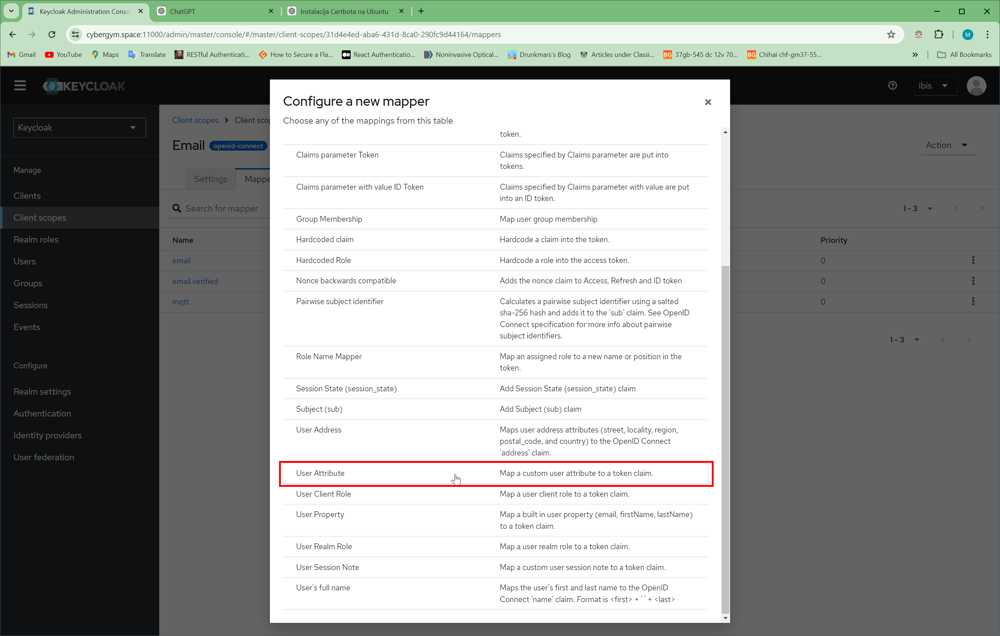

# IBIS Projekat

Ovaj repozitorijum sadrži projekat iz predmeta IBIS koji su izradili Marko Đorđić i Marko Đurđević.

## Opis Projekta

U okviru ovog projekta implementiran je sistem za nadgledanje i upravljanje metroom u Beogradu. Projekat predstavlja unapređenje postojećeg projekta [Metro](https://github.com/Djordje99/IBIS_Project) rađenog 2023. godine na predmetu Informaciona bezbednost u infrastrukturnim sistemima. Za implementaciju projekta korišćen je programski jezik Python, Flask framework za API i komunikaciju, Mosquitto MQTT broker, Keycloak Identity servis, InView Cloud SCADA kao i Docker za kontejnerizaciju. Arhitektura postojećeg sistema unapređena je u pravcu povećanja bezbednosti sistema. To je postignuto dodavanjem servisa za autentifikaciju i autorizaciju korisnika kao i obezbeđivanjem komunikacionih kanala.


Aplikacija se sastoji od pet komponenti: Keycloak Identity servisa, MQTT Brokera, Simulatora, Klijenta i InView SCADA sistema.

1. Keycloak Identity Service
Keycloak se koristi kao centralni servis za autentifikaciju i autorizaciju korisnika, podržavajući RBAC (kontrola pristupa zasnovana na ulogama). Integrisan je s Mosquitto MQTT brokerom putem OAuth plugina, omogućavajući sigurnu autentifikaciju i autorizaciju korisnika koji pristupaju brokeru.

2. Mosquitto MQTT Broker
Mosquitto MQTT broker je unapređen dodavanjem OAuth plugina za integraciju s Keycloak-om, čime se omogućava kontrola pristupa i sigurnost komunikacije putem TLS enkripcije.

3. Simulator
Simulator je razvijen kao Flask REST API aplikacija i simulira vozove na metrou. Koristi više niti za simultano pokretanje različitih vozova, s mogućnošću zaustavljanja i nastavka rada.

4. MQTT Client
MQTT klijent prikuplja podatke iz simulatora i šalje ih na MQTT broker, uz osluškivanje promjena na SCADA sistemu. Klijent koristi TLS enkripciju za sigurnu komunikaciju.

5. InView SCADA
InView Cloud SCADA omogućava daljinsko nadgledanje i upravljanje putem pretraživača, s glavnim komponentama Editor i Client za konfiguraciju i prikaz podataka prikupljenih sa MQTT broker-a.

## Scenario napada na sistem

Kompletan scenario napada na sistem možete pronaći [ovde](ReverseShellAttack)

## Dokumentacija

Dokumentaciju projekta sa detaljnim opisom komponenti možete pronaći [ovde](IBIS Documentation.pdf)

## Uputstvo za Pokretanje Sistema

Za lokalno pokretanje neophodno je generisati self-signed sertifikate.

### 1. Generisanje lokalnih SSL sertifikata pomoću OpenSSL-a

Prvo, instalirajte OpenSSL ako već nije instaliran:

```sh
sudo apt install openssl
```

Zatim generišite privatni ključ, CSR (Certificate Signing Request), i samopotpisani sertifikat:

```sh
# Generisanje ključa lažne sertifikacione autoritete (CA)
openssl genrsa -des3 -out ca.key 2048

# Generisanje zahteva za potpisivanje sertifikata za lažnu CA
openssl req -new -key ca.key -out ca-cert-request.csr -sha256
# Unesite naziv organizacije kao "Fake Authority" i nemojte unositi zajedničko ime (common name)

# Kreiranje root sertifikata lažne CA
openssl x509 -req -in ca-cert-request.csr -signkey ca.key -out ca-root-cert.crt -days 365 -sha256

# Kreiranje para ključeva za server / MQTT broker
openssl genrsa -out server.key 2048

# Generisanje zahteva za potpisivanje sertifikata koristeći ključ servera za slanje lažnoj CA radi verifikacije identiteta
openssl req -new -key server.key -out server-cert-request.csr -sha256
# Unesite naziv organizacije kao "Localhost MQTT Broker Inc." i zajedničko ime (common name) treba biti localhost ili tačno ime domena koji koristite za povezivanje na MQTT broker

# Kao lažna CA, primate zahtev servera za vaš potpis. Verifikovali ste da je server onaj za koji se izdaje (MQTT broker koji radi na localhost-u), stoga kreirajte novi sertifikat i potpišite ga sa svim ovlašćenjima vaše lažne autoritete.
openssl x509 -req -in server-cert-request.csr -CA ca-root-cert.crt -CAkey ca.key -CAcreateserial -out server.crt -days 360
```

### 2. Kreiranje direktorijuma za certifikate

Kreirajte direktorijum `certs` u vašem projektu i premestite generisane sertifikate u taj direktorijum:

```sh
mkdir certs
mv ca-root-cert.crt certs/
mv server.key certs/
mv server.crt certs/
```

### 3. Pokretanje Identity servisa (Keycloak) unutar Docker Compose-a

```sh
docker-compose -f Auth/docker-compose.yml up -d
```

Nakon pokretanja ove komande keycloak ce biti dostupan na [localhost:11000](localhost:11000)


### 4. Podesavanje Keycloak-a i pokretanje MQTT brokera

#### 4.1. Kreiranje Keycloak klijenta

Nakon sto smo pokrenuli Keycloak neophodno je podesiti klijenta preko kog ce MQTT broker komunicirati sa klijentom


#### 4.2. Podesavanje MQTT broker-a

Nakon sto je klijent kreiran neophodno je da dodamo kredencijale klijenta kako bi MQTT broker mogao da proverava kredencijale korisnika koji se povezuju na njega.
To cinimo izmenom mosquitto.conf fajla koji se nalazi unutar ***MQTTBroker -> mosquitto-go-auth-oauth2*** foldera.

Izgled **mosquitto.conf** fajla
```
auth_plugin /mosquitto/go-auth.so

# Basic Mosquitto configuration
persistence true
persistence_location /var/lib/mosquitto/

# Set the listener port
listener 8883

# Using self-signed cert as CA
cafile /mosquitto/certs/ca-root-cert.crt
certfile /mosquitto/certs/server.crt
keyfile /mosquitto/certs/server.key

auth_opt_log_level debug
auth_opt_log_dest stdout
auth_opt_backends plugin, files
auth_opt_check_prefix false

# auth_opt_files_password_path /etc/mosquitto/auth/passwords
# auth_opt_files_acl_path /etc/mosquitto/auth/acls

# auth_opt_cache_host redis
# auth_opt_cache false
# auth_opt_cache_reset true
# # use redis DB 4 to avoid messing with other services.
# auth_opt_cache_db 4

auth_opt_plugin_path /mosquitto/mosquitto-go-auth-oauth2.so
auth_opt_oauth_client_id mqtt_broker
auth_opt_oauth_client_secret <client-secret>
auth_opt_oauth_token_url https://<keycloak_ip_address:port>/realms/master/protocol/openid-connect/token
auth_opt_oauth_userinfo_url https://<keycloak_ip_address:port>/realms/master/protocol/openid-connect/userinfo
auth_opt_oauth_cache_duration 600
# scopes can be a comma seperated list
auth_opt_oauth_scopes openid
```

Client secret mozemo naci unutar ***Clients -> mqtt_broker -> Credentials***


#### 4.3. Podesavanje Cleint scope-a

Kako bi MQTT broker imao pristup `mqtt` atributu unutar tokena neophodno je unutar ***Client scopes -> email***





#### 4.3. Pokretanje MQTT broker-a

Kao kod pokretanja Keycloak-a neophodno je podesiti puteve do sertifikata.

```
version: '3'

services:
  mqtt-broker:
    image: mqtt_broker:latest
    container_name: mqtt-broker
    ports:
      - "8883:8883" # Secure MQTT port
    networks:
      - my_network
    volumes:
      - .<ca-root-cert-path>.crt:/mosquitto/certs/ca-root-cert.crt
      - .<server-path>.key:/mosquitto/certs/server.key
      - .<server-path>.crt:/mosquitto/certs/server.crt

networks:
  my_network:
    driver: bridge
```

Zatim kreiramo MQTT broker docker kontejner
```
docker build -t mqtt_broker ./MQTTBroker/mosquitto-go-auth-oauth2
```

Naposletku treba samo da pokrenemo docker compose fajl koji se nalazi unutar `MQTTBroker` foldera.
```
docker-compose -f MQTTBroker/docker-compose.yml up -d
```

#### 4.4. Postavljanje dodatnog atributa za proveru prava pristupa

Da bismo implementirali proveru prava pristupa neophodno je odati dodatno polje koje ce svaki korisnik imate. Unutar tog polja se upisuju prava pristupa korisnika u sledecem formatu.

```
{
  "topics": {
    "read": [
      "TrainAA",
      "TrainBA",
      "TrainCA"
    ],
    "write": []
  },
  "superuser": false
}

```
Dodavanje dodatnog `mqtt` polja vrsimo u ***Reals settings -> User profile***


#### 4.5. Kreiranje MQTT broker korisnika

Kada smo pokrenuli MQTT brokera neohpodno je kreirati korisnika.
Nakon sto smo ga kreirali neohpodno je da podesimo mqtt atribut unutar korisnika. U ovom slucaju neophodno je da postavimo property "superuser" na true kako bi korisnik koji koristi Simulator imao pristup i citanju i pisanju.
```
{
  "topics": {
    "read": [],
    "write": []
  },
  "superuser": true
}

```


#### 5. Pokretanje simulatora

Neophodno je prvo da podesimo docker-compose.yaml unutar kog se nalaze sledece:
    - Adresa Keycloak servisa
    - Korisnicko ime
    - Lozinka
    - Port

```
version: '3.5'
networks:
  default:
    name: mqtt-simulator
    driver: bridge
services:
  simulator:
    image: simulator
    ports:
      - 5000:5000
  mqtt:
    image: mqtt
    ports:
      - 5001:5001
    stdin_open: true # docker run -i
    tty: true # docker run -t
    environment:
      - BROKER=<keycloak-adress>
      - PORT=<keycloak-port(8883)>
      - CLIENT_ID=mqtt-client-123444
      - USERNAME=<username>
      - PASSWORD=<password>
```

Naposletku pokrecemo komandu koja pokrece simulator i mqtt klijenta

```
docker build -t mqtt ./MQTT
docker build -t simulator ./Simulator
docker-compose up
```